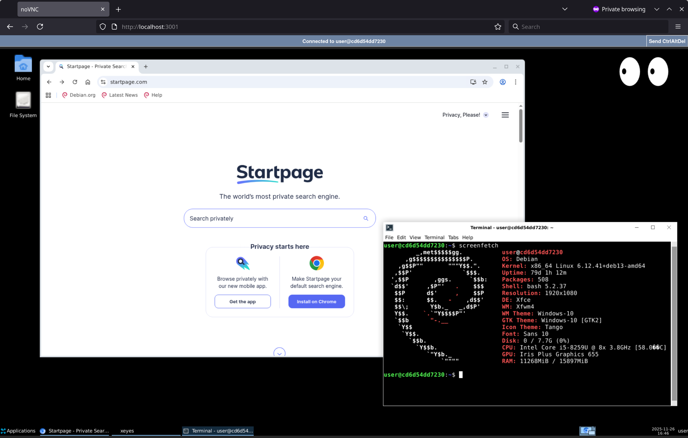

# Chromium Live



This containerized Chromium desktop runs on Linux and is accessible through any web browser.

Try using Docker:
```
docker run -p 3001:3001 ghcr.io/mcp-getgather/chromium-live
```
or Podman:
```
podman run -p 3001:3001 ghcr.io/mcp-getgather/chromium-live
```
Then open `localhost:3001` in your browser.

To enable remote control of Chromium via the [Chrome DevTools Protocol](https://chromedevtools.github.io/devtools-protocol/), map port 9222 as well:
```
podman run -p 3001:3001 -p 9222:9222 ghcr.io/mcp-getgather/chromium-live
```

To test the CDP connection:
```
curl http://127.0.0.1:9222/json/list
```

To build and run locally:
```
docker build -t chromium-live .
docker run -p 3001:3001 chromium-live
```